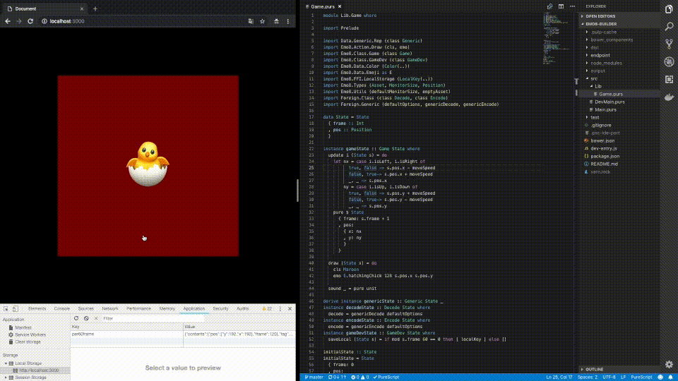

# EMO8 Builder

A convenient build tool for creating [EMO8](https://github.com/opyapeus/purescript-emo8) games.



## Setup

Requirement: `yarn`

```sh
yarn
```

```sh
yarn postinstall
```

## Development

```sh
yarn dev
```

- Development files are generated to dist directory
- Browsersync server runs on http://localhost:3000/

## Production

```sh
yarn build
```

- Production files are generated to dist directory
